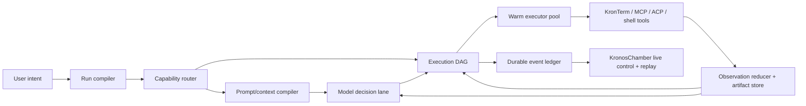

# KronosCode Harness: 10x Runtime and Control Strategy

Date: 2026-08-13

## Executive decision

Do **not** replace KronosCode with Hermes, Claude Code, Codex, or OpenClaw. Turn KronosCode into a small, measurable,
event-driven agent kernel and let those harnesses connect as optional ACP specialists.

The target is a hybrid architecture:

- KronosCode owns the run state machine, workspace truth, capability security, tool routing, checkpoints, and UI events.
- KronosChamber is the control surface and run debugger, not a second agent runtime.
- KronTerm supplies native workspace, terminal, browser, file, sandbox, computer-use, and iPhone-adjacent surfaces.
- Hermes, Codex, Claude Code, and other ACP agents can execute specialist tasks through scoped capability leases.
- MCP/WSH remain transports and capability boundaries. They must not become the planning brain or expose a permanent raw key.

The main performance formula is:

> speed = fewer model calls + smaller cached prompts + fewer visible tool schemas + warm executors + parallel independent work

Changing the harness name without changing those variables will not make KronosCode vastly faster.

## What KronosCode already has

This is not a blank-slate rebuild. The current engine already contains most important primitives:

- A persistent session loop with retries, compaction, structured output, cancellation, and streamed events in
  `kronoscoder/packages/kronoscode/src/session/prompt.ts` and `processor.ts`.
- A capability broker and per-agent tool packs in `session/capability-broker.ts` and `tool/registry.ts`.
- Built-in, plugin, marketplace, and MCP tool sources.
- Parallel built-in execution through `tool/batch.ts`.
- Skills, skill suggestions, and a ten-minute prewarm cache in `skill/prewarm.ts`.
- Permission rules and tool lifecycle hooks.
- Subtasks, spawned agents, snapshots, handoffs, consensus, computer use, browser control, LSP, and KronTerm tools.
- Provider-specific options, prompt caching structure, telemetry, and model variants in `session/llm.ts`.

The correct move is therefore consolidation and measurement, not adding another pile of features.

## Current structural bottlenecks

### 1. The orchestration hot path is too large

`session/prompt.ts` is about 2,100 lines and combines session resumption, title generation, model lookup, subtask execution,
compaction, routing, tool construction, prompt assembly, structured output, summaries, queued turns, and the core loop.
This makes latency instrumentation, replay, testing, and safe optimization harder than necessary.

### 2. Tool routing is broad and repeatedly expensive

The registry contains roughly 80 built-ins before custom and MCP tools. Each loop can load capabilities, poll MCP state,
initialize eligible tools, transform every schema, and then expose the surviving definitions to the model.

The current broker is useful but classifies from regex keywords across a small number of task classes. It selects a runtime
family, while the later pack filter does most of the actual pruning. This is too coarse for requests combining code, browser,
desktop, research, and integrations.

### 3. Parallelism exists as a tool, not as a scheduler

`batch` can run independent built-ins in parallel, but the model must notice the opportunity and construct the batch.
External MCP tools cannot use that path. There is no run-level dependency graph, automatic fan-out, critical-path tracking,
or concurrency budget.

### 4. Prompt caching is prepared, but prompt compilation is not explicit

`session/llm.ts` preserves a stable header for caching, which is good. However, system prompt construction still collects
global, runtime, capability, workspace, instruction, agent, and user-system material every turn. There is no first-class
compiled prompt artifact with fingerprints, byte/token budgets, cache-hit metrics, or invalidation reasons.

### 5. Tool observations are model payloads instead of durable artifacts

MCP text is concatenated into the tool response, images become data URLs, and verbose command/browser output can still
flow back into the model. This increases serialization cost, context growth, and compaction frequency. Large observations
should be stored once and referenced by a compact typed summary.

### 6. Skills are prewarmed by repository heuristics, not turn intent

Current suggestions mainly infer language/framework from files such as `package.json`. The cache saves I/O, but it does not
rank skills from the user request, recent failures, selected tools, workspace surface, or agent role.

### 7. The current eval is a contract smoke test

`scripts/eval-agent-stack.mjs` validates prompt text, schema fields, runtime status, connector health, and UI policy. It does
not measure task completion, routing accuracy, first-tool latency, number of model turns, tool retries, prompt cache hits,
token cost, or human interventions. Without those measures, “faster” changes are guesses.

## Proposed kernel



### The AgentRun contract

Every user turn should compile into one durable `AgentRun`:

```ts
type AgentRun = {
    id: string
    sessionId: string
    intent: IntentEnvelope
    mode: "answer" | "plan" | "execute" | "review" | "autonomous"
    budget: RunBudget
    capabilityLease: CapabilityLease
    contextFingerprint: string
    graph: ExecutionGraph
    checkpoint: RunCheckpoint
    status: "queued" | "routing" | "running" | "waiting" | "completed" | "failed" | "cancelled"
}
```

This becomes the single contract shared by KronosCode, KronosChamber, ACP backends, and the UI. It allows resume, replay,
cancellation, timeouts, steering, and evidence inspection without reverse-engineering message history.

## Stack-ranked 10x opportunities

### 1. Dynamic Tool Search and Capability Leases — highest impact

Expose a tiny stable tool surface on every turn:

- `tool_search(query, constraints)`
- `tool_describe(ids)`
- `tool_call(id, args)` or deferred native tool definitions
- `exec` / `apply_patch` / `read` only when the current mode makes them highly likely
- run control: plan, goal, wait, notify, ask, checkpoint

The router searches a locally indexed capability catalog and activates only 5–12 tools for the next decision. A capability
lease contains exact operations, resources, risk, expiry, agent identity, and approval policy. The lease replaces both a flat
tool catalog and permanent shared credentials.

Why it is 10x: less tool-schema input, better tool-selection accuracy, faster provider serialization, narrower permissions,
and simpler mode switching.

Build on the existing `ToolRegistry`, tool packs, capability manifest, per-agent permissions, and scoped surface JWT. Do not
introduce a second registry.

### 2. Dual execution lanes — model lane plus deterministic lane

Use the model lane when results require semantic judgment, the next action genuinely depends on a result, or approval is
needed. Use a bounded deterministic/programmatic lane for known workflows such as:

- search files -> read matches -> extract symbols -> return a compact evidence set;
- capture UI tree + screenshot delta -> locate target -> perform action -> verify;
- run typecheck + focused tests + summarize failures;
- query several read-only tools concurrently and reduce results;
- inspect connector health -> choose fallback -> retry within a fixed budget.

Each deterministic stage must declare eligible tools, maximum calls, concurrency, retry policy, stop conditions, output
schema, and when control returns to the model. This preserves agent judgment while eliminating unnecessary model round
trips.

### 3. Compiled prompt and context tiers

Compile context into stable, contextual, and volatile tiers:

- **Stable:** product identity, safety rules, tool-use protocol, mode contract, agent definition.
- **Contextual:** repository instructions, selected skill bodies, workspace map, active capability schemas.
- **Volatile:** user turn, changed files, live UI selection, tool deltas, current plan and run status.

Fingerprint every tier. Reuse unchanged provider prefixes. Log why a tier changed. Enforce byte and token budgets before
the provider call, with progressive disclosure for files, skills, memory, tools, and UI observations.

### 4. Automatic execution DAG

The run compiler should produce a small graph of typed nodes: `model`, `tool`, `approval`, `reduce`, `verify`, and
`checkpoint`. The scheduler automatically parallelizes nodes with no data dependency and limits fan-out based on budget,
risk, workspace conflicts, and provider rate limits.

This is better than always spawning agents. Multi-agent work should be reserved for cleanly independent, context-heavy
branches. Cheap file reads and connector queries belong in the deterministic executor, not separate model sessions.

### 5. Observation reducer and artifact store

Every tool returns a standard envelope:

```ts
type ToolObservation = {
    ok: boolean
    summary: string
    facts: Array<{ key: string; value: unknown }>
    artifacts: Array<{ uri: string; mime: string; bytes: number; digest: string }>
    changes: ChangeSet
    diagnostics: Diagnostic[]
    timing: ToolTiming
    retry: RetryAdvice
}
```

Full stdout, screenshots, DOM snapshots, patches, and logs go to an artifact store. The model receives the summary, facts,
diagnostics, and artifact references. It can request a slice when necessary.

For computer use, store one full observation followed by semantic/accessibility and image deltas. Do not resend unchanged
screens. Require a cheap post-action verification signal before another model decision.

### 6. Durable event ledger, checkpoint, and replay

Persist run events such as `run.created`, `route.selected`, `model.started`, `tool.started`, `tool.completed`,
`approval.requested`, `artifact.created`, `checkpoint.saved`, and `run.completed` with idempotency keys.

KronosChamber should render this ledger as a live activity graph and allow:

- pause, resume, cancel, steer, retry node, switch specialist, and lower/raise autonomy;
- inspect exact prompt tier fingerprints and active tools;
- compare expected versus actual timing;
- replay a failed run against a new harness version;
- recover after Electron, agent, connector, or network restarts.

### 7. Real trajectory and performance evaluation

Create a versioned benchmark of 25 representative KronTerm tasks, then expand to 100. Include:

- code diagnosis and focused fix;
- mixed frontend/backend change;
- browser research with citations;
- KronTerm block/layout operation;
- native macOS action with verification;
- sandbox and remote task;
- connector task with authentication or approval;
- interruption, restart, and resume;
- ambiguous request requiring a question;
- failed tool with fallback.

Measure per run:

- completion and verification score;
- time to acknowledgement, first token, first tool, useful progress, and completion;
- model calls, tool calls, retries, dead ends, and approval count;
- prompt input, cache read/write, output, reasoning tokens, and cost;
- router precision/recall and unused visible tools;
- context-compaction count;
- failure recovery and resume success;
- user steering needed.

Run A/B replays for every harness change. Optimize the whole distribution, especially p50 and p95, rather than a demo.

## Medium-impact improvements

### Adaptive model and reasoning policy

Route by measured task difficulty:

- local/rules engine: tool search, policy, dependency graph, result reduction when deterministic;
- small fast model: intent classification, query rewriting, simple summarization;
- main model with low/medium reasoning: normal coding and control turns;
- high reasoning: architecture, difficult debugging, risky multi-system changes only;
- specialist ACP backend: explicit fit or measured superiority on that task family.

The selected model and effort should be visible and switchable in KronosChamber. Do not use a premium/high-reasoning model
for titles, routing, summaries, or simple tool-result normalization.

### Warm executor pool

Keep alive:

- one non-interactive shell broker per workspace and environment;
- authenticated MCP connections with lazy tool-schema fetch;
- browser and computer-use sessions;
- sandbox images and frequently used language servers;
- provider HTTP clients and credentials;
- skill and repository indexes.

Measure cold and warm startup separately. Hermes specifically warns that heavy interactive shell initialization can add
latency to every agent command; KronosCode should bypass interactive shell startup for non-interactive runs.

### Tool health and fallback scoring

Extend the current scorecard from static status to exponentially weighted success, latency, timeout, cancellation, and
user-correction rates. Select among equivalent implementations using live health and task fit. A failing connector should
trip a short circuit breaker instead of repeatedly consuming model turns.

### Intent-aware skill retrieval

Retain progressive disclosure, but rank skills from:

- the current user turn and selected mode;
- repository/framework signals;
- chosen capabilities and workspace surface;
- recent tool failures and diagnostics;
- agent role and project memory.

Inject only summaries until a skill is selected. Prewarm selected skill bodies concurrently with initial routing. Agent-made
skill changes require review, provenance, tests, and an approval gate.

### Permission policy compiler

Compile user mode, agent role, workspace scope, tool risk, target resource, and channel into a single capability lease.
Auto-approve repeatable low-risk actions inside the lease; batch related approvals; pause safely for destructive, external,
credential, or cross-machine actions. Hooks may transform inputs/results and emit async telemetry, but security hooks must
remain synchronous and fail closed.

## Competitive pattern map

| Harness | Pattern worth adopting | What KronosCode should avoid copying |
| --- | --- | --- |
| Hermes | Stable/context/volatile prompt tiers; central toolsets; progressive skills; provider/runtime sharing; SQLite session lineage; tool backends | A single very large synchronous agent-loop file; flat exposure of a large catalog |
| Codex | Lean prompts; relevant-tool selection; programmatic tool calling for bounded workflows; persisted reasoning/cache; eval-driven model/effort decisions | High reasoning or multi-agent execution by default |
| Claude Code | Typed lifecycle hooks; scoped subagent tools/MCP/skills/memory; worktree isolation; explicit permission modes; resumable agents | Preloading full skills or MCP catalogs when they are not needed |
| OpenClaw | Gateway durability; sessions/memory/automation; tool profiles; tool search for large catalogs; compact result handling; nodes and channels | One always-on authority boundary holding broad credentials without strict provenance and leases |
| KronosCode | Persistent visual workspace, live blocks, browser/terminal/file context, native control, scoped WSH/MCP bridge, KronosChamber, optional iPhone Labs client | Becoming a thin skin around somebody else’s runtime |

Sources:

- [OpenAI: latest model and agent guidance](https://developers.openai.com/api/docs/guides/latest-model)
- [Hermes architecture](https://hermes-agent.nousresearch.com/docs/developer-guide/architecture)
- [Hermes tools and toolsets](https://hermes-agent.nousresearch.com/docs/user-guide/features/tools/)
- [Hermes skills and progressive disclosure](https://hermes-agent.nousresearch.com/docs/user-guide/features/skills/)
- [Claude Code hooks](https://code.claude.com/docs/en/agent-sdk/hooks)
- [Claude Code subagents](https://code.claude.com/docs/en/sub-agents)
- [OpenClaw tools](https://github.com/openclaw/openclaw/blob/main/docs/tools/index.md)
- [OpenClaw agent configuration](https://github.com/openclaw/openclaw/blob/main/docs/gateway/config-agents.md)

## Timing service-level objectives

These are product targets to validate on the benchmark, not claims about current performance:

| Stage | Warm p50 target | Warm p95 target |
| --- | ---: | ---: |
| UI acknowledgement and run creation | < 50 ms | < 120 ms |
| Local intent/capability routing | < 25 ms | < 75 ms |
| Prompt/tool manifest compilation | < 40 ms | < 100 ms |
| First provider request dispatched | < 150 ms | < 350 ms |
| Harness overhead per local tool call | < 20 ms | < 75 ms |
| Live tool event visible in Chamber | < 50 ms | < 150 ms |
| Warm terminal command startup overhead | < 30 ms | < 100 ms |
| UI/computer observation delta creation | < 100 ms | < 250 ms |
| Crash/restart checkpoint resume | < 1 s | < 3 s |

Provider, network, build, browser-page, and command execution time are measured separately so they do not hide harness
overhead.

## Delivery plan

### Do now: two to three weeks

1. Define the `AgentRun`, event, capability lease, and observation envelopes without changing user behavior.
2. Instrument the existing loop end to end with monotonic timing, token, cache, schema-byte, and retry metrics.
3. Build the first 25-task benchmark and record the current baseline.
4. Add a local indexed tool catalog and expose tool-search metrics; shadow-route before enforcing selection.
5. Cache initialized built-in schemas by model/provider/agent/config fingerprint.
6. Cache MCP manifests per connection generation; stop polling and rebuilding unchanged schemas each loop.
7. Normalize/truncate tool results into summaries and artifacts.
8. Record idempotency keys and durable run checkpoints.

Success gate: no quality regression; at least 30% fewer tool-schema input bytes and 20% lower median harness overhead on
the benchmark.

### Do next: four to eight weeks

1. Enforce dynamic tool activation with a safe core-tool fallback.
2. Extract the large session loop into testable run compiler, scheduler, executor, context compiler, and recovery modules.
3. Add deterministic bounded workflows for repository investigation, verification, browser observation/action, and connector
   health/fallback.
4. Add automatic DAG concurrency with conflict detection and budgets.
5. Implement semantic UI/DOM/image deltas and artifact references.
6. Add adaptive model/reasoning selection and A/B replay.
7. Render the event graph, timing waterfall, active capabilities, approvals, and retry controls in KronosChamber.

Success gate: 40–60% fewer model turns on bounded workflows, 30% lower median completion time, and improved or unchanged
verified task success.

### Explore after measurement

- A learned local router trained from successful trajectories, with the rule router as deterministic fallback.
- Speculative prefetch of likely files, skills, tools, and browser state while the first model response streams.
- Work-stealing multi-agent scheduling for large independent branches.
- Distributed execution across Mac, sandbox, remote SSH, and paired phone nodes.
- Reviewed self-improvement proposals generated from repeated tool failures and user corrections.

## Things not to do

- Do not wholesale-replace KronosCode with Hermes; that would trade known integration debt for new integration debt.
- Do not expose a permanent raw WSH key. Continue using short-lived scoped JWT capability leases.
- Do not add more tools to the default flat catalog.
- Do not turn every task into a multi-agent swarm.
- Do not use an LLM for deterministic policy, health checks, simple reductions, or graph scheduling.
- Do not hide execution latency behind animations. UI motion should communicate real state and remain interruptible.
- Do not let agents silently rewrite shared skills or permissions.
- Do not optimize token cost alone; a cheaper run that needs human correction is slower.

## The first concrete engineering slice

Start with **Harness Flight Recorder + Dynamic Tool Shadow Router**:

1. Record one structured event for every routing, provider, tool, approval, compaction, and retry transition.
2. Calculate the tools the new router would expose, but keep current execution unchanged.
3. Compare selected versus actually used tools, schema bytes, latency, and failures across the benchmark.
4. Cache built-in and MCP tool definitions by fingerprint.
5. Switch task families to enforced dynamic activation only after shadow precision is high.

This slice is low-risk, directly improves observability, produces the evidence needed for all later decisions, and can yield
immediate speed gains from schema caching before the deeper run-kernel refactor.
