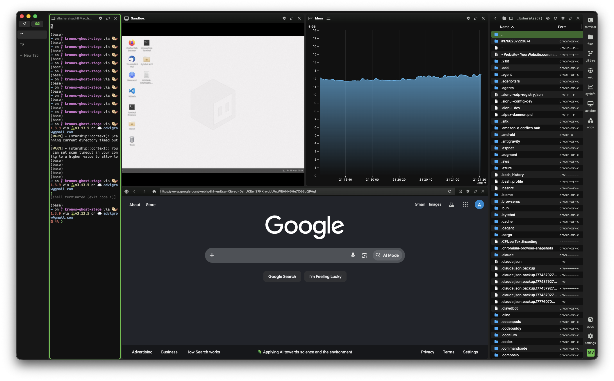
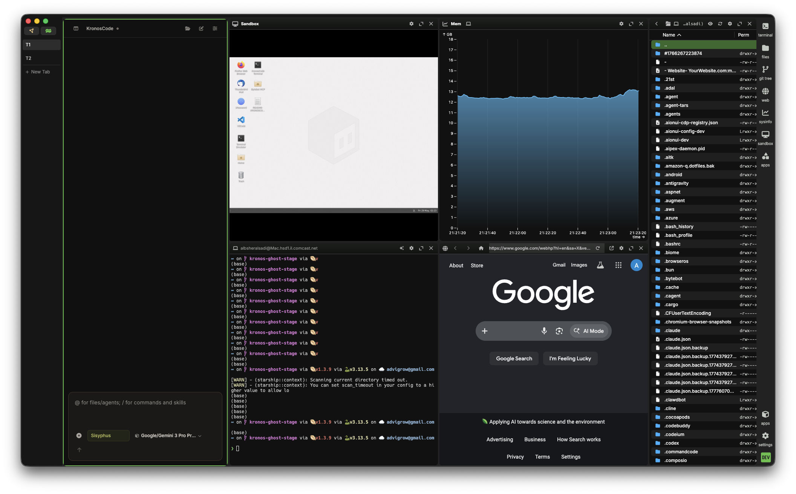

<p align="center">
  <a href="https://www.kronterm.dev">
    
  </a>
</p>

<p align="center">
  <b>The AI-native terminal that replaces your sandboxes, browser tabs, and tile managers.</b>
</p>

<p align="center">
  <a href="https://www.kronterm.dev/download"></a>
  <a href="https://docs.kronterm.dev"></a>
  <a href="https://discord.gg/XfvZ334gwU"></a>
  <a href="https://x.com/krontermdev"></a>
  <a href="LICENSE"></a>
  <a href="https://github.com/sponsors/krontermdev"></a>
</p>

---

## Stop juggling tools. One workspace rules them all.

KronTerm isn't another terminal emulator. It's a **unified workspace** that fuses terminal, editor, browser, and AI into a single canvas — so you stop context-switching and start shipping.

<p align="center">
  
</p>

Need a sandbox to test an idea? A browser to check docs? A terminal to SSH into prod? An AI to debug an error? It's all here, in drag-and-drop blocks, side by side.

---

## Why KronTerm?

Most developers keep 5+ apps open at all times — terminal, browser, editor, AI chat, sandbox, notes — each in its own window, each fighting for screen space. KronTerm replaces that pile with one cohesive workspace.

### 🧩 Replace your sandboxes
Spin up isolated environments alongside your code, not in a separate tab. Run commands, test scripts, and iterate without leaving your flow.

<p align="center">
  
</p>

### 🌐 Replace your browser clutter
Inline web views for docs, dashboards, and previews — right next to your code. No more alt-tabbing through 20 tabs.

### 🪟 Replace your tile manager
Drag-and-drop blocks that snap into any layout. Full-screen any block on demand. It's i3/bspwm flexibility without the config headache.

### 🤖 Replace your AI window
Built-in AI assistant that sees everything in your workspace — your terminal output, your open files, your web views. No separate chat app needed.

<p align="center">
  
</p>

---

## Key Features

### 🤖 AI-Native Terminal
KronTerm AI is built into the terminal itself — not a bolted-on sidebar. It reads your terminal output, understands your workspace context, and performs file operations across local and remote machines. Bring your own keys for OpenAI, Claude, Gemini, or run local models via Ollama and LM Studio. No accounts, no cloud dependency.

### 🧠 KronosCode — The AI Engine That Controls Everything
KronosCode is the brain behind KronTerm's AI capabilities. It's an **agentic AI engine** that doesn't just chat — it operates your workspace. KronosCode agents can:

- **Create, close, and arrange blocks** — spin up terminals, web views, previews, and sandboxes on demand
- **Read and interact with widgets** — take screenshots, inspect elements, click buttons, type text, scroll content
- **Run terminal commands** — execute shell commands, read scrollback, parse output
- **Browse the web** — navigate pages, fill forms, scrape data, take browser screenshots all within a KronTerm block
- **Edit files** — read, write, and modify code with intelligent diff previews and rollback support
- **Manage SSH connections** — connect, disconnect, and operate on remote machines

#### How It Works
KronosCode operates through **ACP (Agent Control Protocol)** — a tool system that exposes every KronTerm capability as a callable function. Agents like **Sisyphus** (the orchestrator) delegate work to specialists:

| Agent | Role | Tools Used |
|-------|------|------------|
| **Sisyphus** | Orchestrator — plans and delegates | todo management, task spawning |
| **Hephaestus** | Deep coding & implementation | file editing, desktop control, git |
| **Prometheus** | Strategic planning | architecture analysis, requirements |
| **Oracle** | Architecture & debugging consultant | read-only code analysis |
| **Librarian** | Codebase search & documentation | grep, glob, AST search |
| **Kronos** | Sandbox desktop automation | E2B sandbox tools |
| **Browser Agent** | Web automation | browser navigation, click, type |

Every agent uses KronTerm's native MCP tools — the same ones exposed to you through the UI — to read your terminal, inspect blocks, take screenshots, run commands, and edit files. This is what makes KronTerm truly **AI-native**: the AI doesn't sit in a separate window; it lives inside your workspace and can touch everything.

> **KronosCode is included with KronTerm.** The agent system is available now. ACP premium agents (Hermes, OpenClaw, Codex) are coming soon.

### 🧩 The Workspace — Blocks, Not Windows
Drag, drop, resize, and arrange terminals, editors, web views, AI chats, previews, and sandboxes into any layout. Every block can full-screen with one click.

### 🔗 Durable SSH Sessions
Your remote connections survive network drops, sleep cycles, and even KronTerm restarts. Automatic reconnection means you never lose your session mid-work. Includes a built-in graphical editor for remote files, inline previews for markdown, images, CSVs, PDFs, and more.

### 💻 Cross-Platform by Design
macOS, Linux, and Windows — same experience everywhere. Native performance with Electron + Go backend, connected by WebSocket RPC.

### 🎯 Command Blocks
Isolate and monitor individual commands in their own block. See output in real time, rerun, and capture results without polluting your main terminal.

### 🔐 Secret Storage & Security
API keys, credentials, and secrets stored using native system backends (macOS Keychain, Linux secret service, Windows Credential Manager). Access them seamlessly across local and SSH sessions.

### 🎨 Full Customization
Tab themes, terminal styles, background images, custom keybindings. Make it yours.

---

## ⚡ ACP Agents — Premium TUI Intelligence

KronTerm is expanding beyond the terminal with **ACP (Agent Control Protocol)** — a system for running personal TUI agents that live in your workspace:

| Agent | Role |
|-------|------|
| **Hermes** | Personal automation agent — orchestrates your workspace, runs workflows, manages your dev loop |
| **OpenClaw** | File system intelligence — navigates, understands, and operates on your codebase |
| **Codex** | Code generation & analysis agent — powered by advanced AI for deep engineering work |

> **Premium feature.** ACP agents are coming as part of KronTerm's premium tier, giving you autonomous TUI assistants that work alongside you.

---

## 🔮 The Future — KronTerm API

We're building a **full control API** for KronTerm — programmatically create blocks, run commands, manage layouts, trigger agents, and integrate KronTerm into your own tools and pipelines.

The KronTerm API turns your workspace into a programmable surface. CI pipelines, automation scripts, and custom tools will be able to drive KronTerm like a headless development environment.

---

## Installation

KronTerm runs on macOS 11+, Windows 10 1809+, and Linux (glibc 2.28+).

| Platform | Download |
|----------|----------|
| macOS (arm64 / x64) | [kronterm.dev/download](https://www.kronterm.dev/download) |
| Windows (x64) | [kronterm.dev/download](https://www.kronterm.dev/download) |
| Linux (arm64 / x64) | [kronterm.dev/download](https://www.kronterm.dev/download) |

See [the docs](https://docs.kronterm.dev/gettingstarted) for detailed installation guides.

### Build from Source

```bash
git clone https://github.com/krontermdev/kronterm.git
cd kronterm
task dev
```

See [BUILD.md](BUILD.md) for full build instructions.

---

## Roadmap

KronTerm is under active development. See [ROADMAP.md](./ROADMAP.md) for what's coming next.

Want to influence the direction? Join our [Discord](https://discord.gg/XfvZ334gwU) or open a [Feature Request](https://github.com/krontermdev/kronterm/issues/new/choose).

---

## Community & Links

- **Homepage** — [kronterm.dev](https://www.kronterm.dev)
- **Documentation** — [docs.kronterm.dev](https://docs.kronterm.dev)
- **Download** — [kronterm.dev/download](https://www.kronterm.dev/download)
- **X (Twitter)** — [@krontermdev](https://x.com/krontermdev)
- **Discord** — [Join the community](https://discord.gg/XfvZ334gwU)
- **GitHub** — [krontermdev/kronterm](https://github.com/krontermdev/kronterm)

---

## Contributing

We welcome contributions! See [CONTRIBUTING.md](CONTRIBUTING.md) for guidelines.

### Sponsoring KronTerm ❤️

If KronTerm is useful to you or your company, consider [sponsoring development](https://github.com/sponsors/krontermdev). Sponsorship supports the time and effort spent building and maintaining the project.

---

## License

KronTerm is licensed under the [Apache 2.0 License](LICENSE). See [ACKNOWLEDGEMENTS.md](./ACKNOWLEDGEMENTS.md) for dependency information.

[](https://app.fossa.com/projects/git%2Bgithub.com%2Fkrontermdev%2Fkronterm?ref=badge_large)
