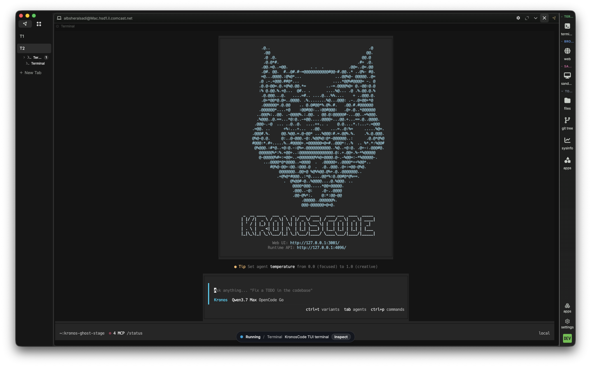
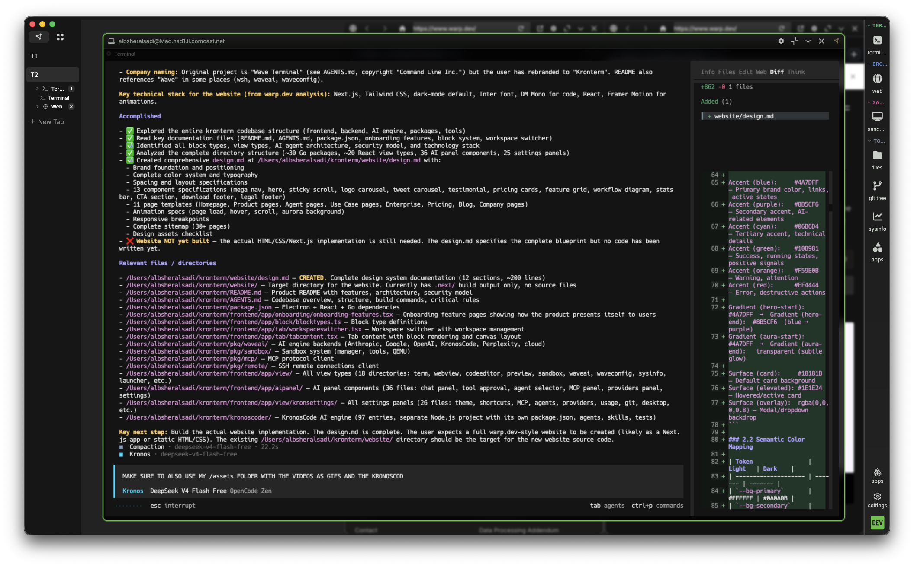
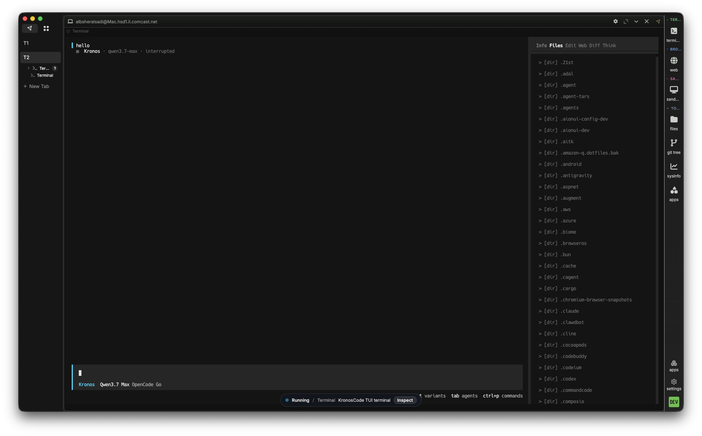
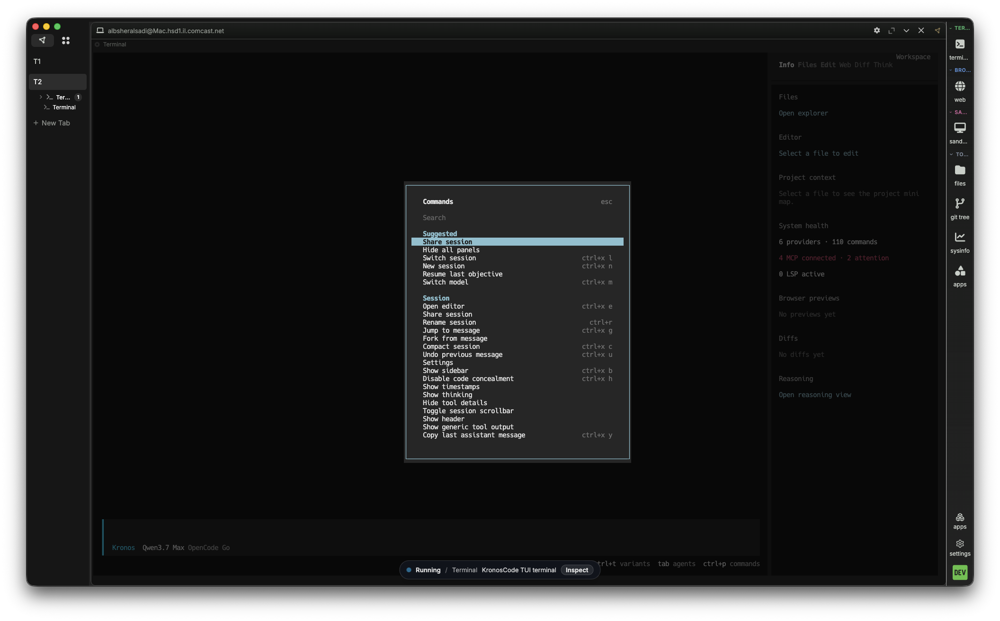
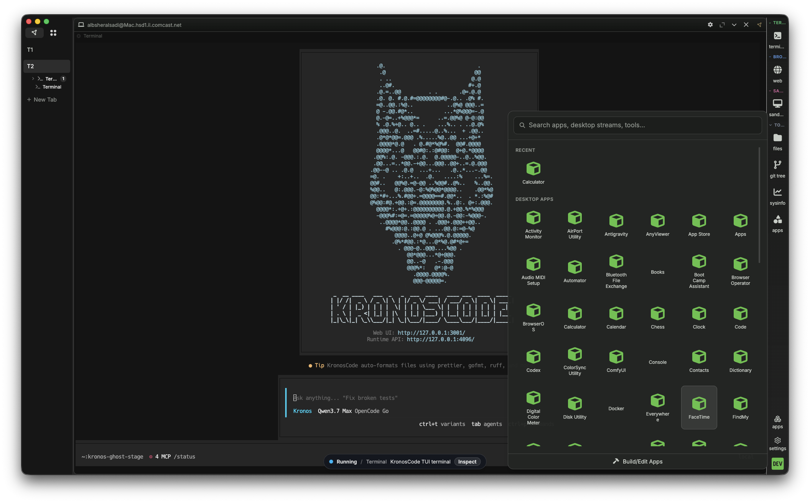

<p align="center">
  <picture>
    <source media="(prefers-color-scheme: dark)" srcset="data:image/svg+xml;base64,PHN2ZyB3aWR0aD0iNDAiIGhlaWdodD0iNDAiIHZpZXdCb3g9IjAgMCA0MCA0MCIgZmlsbD0ibm9uZSIgeG1sbnM9Imh0dHA6Ly93d3cudzMub3JnLzIwMDAvc3ZnIj48cmVjdCB3aWR0aD0iNDAiIGhlaWdodD0iNDAiIHJ4PSI4IiBmaWxsPSIjNjVDNUYxIi8+PHRleHQgeD0iMjAiIHk9IjI2IiB0ZXh0LWFuY2hvcj0ibWlkZGxlIiBmaWxsPSIjMEEwQTBBIiBmb250LWZhbWlseT0iLWFwcGxlLXN5c3RlbSxCbGFja2Zyb3ctc3R5bGVkLEZvbnR3ZWlnaHQ9IjcwMCIgZm9udC1zaXplPSIyMCI+SzwvdGV4dD48L3N2Zz4=">
    
  </picture>
</p>

<h1 align="center">KronTerm</h1>

<p align="center">
  <b>One desktop command center.<br />Terminal · Browser · Sandboxes · AI — fused.</b>
</p>

<p align="center">
  <a href="https://www.kronterm.dev"></a>
  <a href="https://www.kronterm.dev/download"></a>
  <a href="https://docs.kronterm.dev"></a>
  <a href="https://discord.gg/XfvZ334gwU"></a>
  <a href="https://x.com/krontermdev"></a>
</p>

<br />

<p align="center">
  
</p>

<p align="center">
  <i>Terminal · Browser · Editor · Sandboxes · AI Agents · Desktop Control — one surface, one tool in your dock.</i>
</p>

<br />

---

## Why KronTerm?

Every developer keeps a constellation of apps running: a terminal emulator, a browser with dozens of tabs, an IDE, an AI chat window, Docker or a VM, a notes app, maybe a tile manager. Each lives in its own window, owns its own context, and fights for screen space. The AI in the sidebar can't see your build output. The terminal doesn't know what's in the browser. The browser doesn't know what the sandbox is doing.

**KronTerm is the only tool in your dock.**

It collapses your entire toolchain into one programmable canvas where every surface — shells, web views, files, Linux VMs, native apps — is visible to and controllable by AI agents that operate alongside you. Context is shared. Surfaces are programmable. The AI operates on your real workspace, not a chat transcript.

> **Not a terminal emulator.** Not an AI chat sidebar. KronTerm is a vertically integrated command center for serious builders.

<br />

---

## Feature Deep-Dive

### 🧩 Blocks: Every Surface Is a Widget

KronTerm's workspace is built from **blocks** — fully interactive surfaces that you position, resize, stack, or full-screen. Every block exposes a structured accessibility tree via the Widget Protocol, making it visible and controllable by AI.

| Block Type | What It Does |
|------------|-------------|
| **Terminal** | Full PTY with shell integration, scrollback capture, SSH sessions, AI-readable output |
| **Browser** | Embedded Chromium — docs, dashboards, live previews, AI-driven browser automation |
| **Preview** | Renders markdown, images, CSVs, PDFs, HTML — auto-refreshes on file changes |
| **AI Chat** | KronosCode panel with full workspace context — every block, file, and command |
| **Sandbox VM** | Full Linux desktop (E2B) with Firefox, VS Code, terminal — isolated, disposable |
| **Launcher** | Command palette for quick actions and workspace navigation |
| **Sys Info** | Real-time CPU, memory, disk, network monitor |
| **Settings** | Visual editor for themes, keybindings, fonts, AI providers |

The **Widget Protocol** is what makes blocks special. Every block returns a structured element tree via `widget_snapshot`. The AI can click by ref (`@e3`), type, scroll, drag, inspect, and screenshot any block — no separate browser automation tools, PTY libraries, or screen readers needed.

<br />

### 🧠 KronosCode: The AI Engine

**KronosCode is not a chatbot.** It is a structured agentic execution engine that routes every request through a deterministic pipeline:

```
User Request → Router → Planner → Executor → Critic → Summarizer
```

The AI panel sits beside your workspace, seeing every block you have open — terminals, web pages, files, sandboxes. No manual context-pasting.

<p align="center">
  
</p>

<br />

KronosCode agents operate at every layer of the machine:

<p align="center">
  
</p>

<br />

#### Capabilities by Layer

| Layer | What KronosCode Can Do |
|-------|------------------------|
| **Screen** | Screenshots of any block or the host macOS desktop. Pixel color reading. Cursor tracking. |
| **Accessibility** | Full AX tree of native macOS apps. Click by element ref, read values, scroll panels. |
| **Widget** | Annotated screenshots with `@e3` refs, click by ref or coordinate, type, scroll, drag, wait. |
| **Terminal** | Shell commands with timeouts, scrollback capture, exit code parsing, JSON output. |
| **Network** | URL fetch, web search, page scraping, code documentation search, API calls. |
| **Memory** | Screen/audio history via Screenpipe. Recall what was visible minutes ago. |

#### Agent Architecture

KronosCode uses a routing-first design with specialist agents:

```
Kronos (Router)
  ├── Hephaestus — Host terminal, code edits, builds, git
  ├── Sisyphus   — Sandbox VM, desktop widget automation
  ├── Prometheus — Native macOS app control, desktop automation
  ├── Oracle     — Browser blocks, widgets, visible tabs
  └── Librarian  — Web search, code search, documentation research
```

Every tool call is real — no simulation, no narration. If KronosCode emitted a tool call, the runtime executed it.

> **KronosCode is included with KronTerm.** No additional setup. No premium tier for the core agent system.

<br />

#### AI-Assisted Code Editing

KronosCode reads file contents, suggests changes, and shows diffs before applying them:

<p align="center">
  
</p>

<br />

#### Terminal File Explorer

Browse, open, and edit files within the terminal with KronosCode overlay:

<p align="center">
  
</p>

<br />

#### TUI Settings Editor

Configure themes, keybindings, fonts, and AI providers visually from the terminal:

<p align="center">
  
</p>

<br />

#### Streamable Apps

Run a dev server, preview it beside your code, share the view:

<p align="center">
  
</p>

<br />

#### Session Management

AI-managed session history — browse, search, and resume past conversations:

<p align="center">
  <video src="./assets/kronterm-section/video /sidepanel-session-management.mp4" width="85%" controls></video>
</p>

<br />

#### ACP Agent Management

Autonomous background agent configuration and monitoring:

<p align="center">
  <video src="./assets/kronterm-section/video /acp-management.mp4" width="85%" controls></video>
</p>

<br />

### 🌐 Browser Automation, Native

Inline Chromium browser blocks for docs, dashboards, and live app previews — right next to your terminal. Every web block is a target for KronosCode: navigate, fill forms, scrape data, take screenshots, inspect elements — all within the block.

This is **browser automation without Playwright or Selenium**. The `widget_snapshot` API returns the full element tree with refs like `@e3`. The AI clicks by ref, not by fragile coordinate heuristics.

<p align="center">
  
</p>

<br />

### 🖥️ Sandbox VMs: Isolated Linux Desktops

Spin up full Linux desktop VMs (E2B-powered) alongside your code. Each sandbox has Firefox, VS Code, a terminal, and its own file system — and KronosCode operates them directly.

- **Fully isolated** — root access, package installs, network ops. Nothing touches your host.
- **AI-controlled** — KronosCode clicks, types, scrolls, drags, opens apps, reads and writes files inside the sandbox.
- **Disposable by design** — spin up for a test, tear down when done. No Dockerfiles, no cloud VMs.

<p align="center">
  
</p>

<br />

### 🖱️ Native Desktop Control (macOS)

KronosCode observes and controls any native macOS app through the Accessibility API:

| Action | What It Does |
|--------|-------------|
| **See** | Full accessibility tree of any running app — buttons, fields, menus, scroll areas |
| **Click** | By element name, DOM id, or screenshot-pixel coordinates |
| **Type** | Into any focused text field |
| **Press** | Key combinations (⌘+C, ⌘+Shift+P, etc.) |
| **Scroll** | Any direction, lines or pages |
| **Drag** | Between coordinates with configurable duration |
| **Set Values** | On sliders, date pickers, and input fields |

<video src="./assets/kronterm-section/video /kron-computer-use.mp4" width="100%" controls></video>

This bridges the gap between "AI that reads files" and "AI that uses your actual applications."

<br />

### 🔗 Durable SSH & Remote Sessions

Remote connections survive network drops, sleep cycles, and KronTerm restarts. Automatic reconnection means you never lose a session mid-work. Includes a built-in graphical editor for remote files, inline previews for markdown, images, CSVs, PDFs.

<br />

---

## Architecture

KronTerm is a **vertically integrated system** across four layers:

```
┌──────────────────────────────────────────────────────────────┐
│                      USER INTERFACE                          │
│  KronTerm Desktop App (Electron + TypeScript)                 │
│  • Block canvas with drag-and-drop layout engine              │
│  • WebSocket RPC bridge (wsh) between UI and Go backend       │
│  • Native menus, tabs, themes, custom keybindings             │
│  • macOS / Linux / Windows — consistent experience            │
├──────────────────────────────────────────────────────────────┤
│                     WIDGET LAYER (wsh IPC)                    │
│  • Every block is a widget with a structured element tree     │
│  • widget_* tools: snapshot, click, type, scroll, drag        │
│  • Terminal PTY via node-pty (local) or SSH bridge (remote)   │
│  • Chromium Embedded Framework for web blocks                 │
│  • E2B SDK for sandbox VM lifecycle management                │
├──────────────────────────────────────────────────────────────┤
│                    KRONOSCODE AI ENGINE                       │
│  • TypeScript core (Bun runtime)                              │
│  • Vercel AI SDK for multi-provider abstraction               │
│  • Hono HTTP server for local API and MCP endpoints           │
│  • Drizzle ORM + SQLite for session and tool persistence      │
│  • Zod schema validation throughout                          │
│  • LSP integration for code intelligence                      │
│  • 69+ built-in tools + MCP server integration                │
│  • Skills system (loadable domain-specific capabilities)      │
├──────────────────────────────────────────────────────────────┤
│                     AI PROVIDER LAYER                         │
│  • OpenAI (GPT-4o, o3) · Anthropic (Claude 4 Sonnet/Opus)    │
│  • Google (Gemini 2.0 Pro/Flash) · Ollama / LM Studio (local) │
│  • Bring your own keys — no accounts, no cloud dependency     │
│  • Pluggable provider architecture — add your own             │
└──────────────────────────────────────────────────────────────┘
```

### Runtime Stack

| Component | Technology | Role |
|-----------|-----------|------|
| **Desktop Shell** | Electron + TypeScript | Cross-platform window, native OS integrations |
| **Backend** | Go | High-performance IPC, PTY, SSH, WebSocket bridge |
| **AI Engine** | TypeScript + Bun | Agent logic, tool execution, session management |
| **Widget Protocol** | wsh IPC (JSON over WebSocket) | Bidirectional AI ↔ block widget control |
| **Database** | SQLite via Drizzle ORM | Sessions, tool metadata, config storage |
| **AI SDK** | Vercel AI SDK (`ai`) | Multi-provider abstraction, streaming, tool calling |
| **HTTP** | Hono | Local API, MCP server, health checks |
| **Validation** | Zod | Runtime schema validation for all tool parameters |
| **SSH** | Go-based PTY bridge | Durable remote sessions with auto-reconnect |
| **Sandbox** | E2B SDK | Cloud Linux VM lifecycle (Firefox, VS Code, terminal) |
| **Layout Engine** | React + custom tile manager | Drag-and-drop block positioning, snap, full-screen |

<br />

---

## ⚡ ACP Agents: Autonomous Background Intelligence

Beyond KronosCode (on-demand), KronTerm supports **ACP (Agent Control Protocol)** agents — autonomous agents that run continuously, watching your workspace and acting on your behalf:

| Agent | Role |
|-------|------|
| **Hermes** | Personal automation — watches file changes, triggers builds, runs tests on save |
| **OpenClaw** | File system intelligence — navigates codebases, understands dependency graphs, performs large-scale refactors |
| **Codex** | Deep code generation and analysis — generates entire modules, analyzes complex code paths, produces production-grade implementations |

> **Premium feature.** ACP agents are part of KronTerm's commercial tier.

<br />

---

## 🔒 Security Model

KronosCode has deep access to your system. Control is explicit and local:

| Mechanism | What It Prevents |
|-----------|-----------------|
| **Surface routing** | AI can't run macOS commands on the sandbox or vice versa |
| **Tool budgets** | Limits broad searches before coding — prevents runaway API costs |
| **Capability context contract** | Runtime health checks prevent calling unavailable tools |
| **Stop conditions** | AI stops when acceptance checks pass or blocked by missing credentials |
| **Git safety protocol** | Never force-pushes, amends pushed commits, or skips hooks |
| **Bring your own keys** | Your API key → AI provider → local execution. No cloud dependency. No data transit through a KronTerm service. |
| **Secret storage** | OS-native secure store (macOS Keychain, Linux secret service, Windows Credential Manager) |
| **Sandbox isolation** | E2B VMs are fully isolated — root inside the sandbox, zero impact on host |

**Data flow:**

```
Your API Key → AI Provider (OpenAI / Claude / Gemini / Ollama)
     ↓
KronosCode Engine (local — your machine)
     ↓
Tool calls executed locally on your workspace
     ↓
Results return to AI → Response in your workspace
```

Your source code, terminal output, and files never transit through a KronTerm cloud service — because there is no KronTerm cloud service.

<br />

---

## Platforms

| Platform | Status |
|----------|--------|
| macOS (arm64 / x64) | ✅ Private beta |
| Windows (x64) | 🔜 Under evaluation |
| Linux (arm64 / x64) | 🔜 Under evaluation |

**[Request private beta access →](https://www.kronterm.dev/download)**

<br />

---

## Roadmap

- **KronTerm API** — Programmatic workspace control for CI pipelines, automation scripts, and custom tooling.
- **ACP Agents** — Ship Hermes, OpenClaw, and Codex autonomous agents.
- **Shared Workspaces** — Multi-user layouts, remote pair debugging, team workflows.
- **Extended Desktop Control** — Windows and Linux native app automation.
- **Plugin System** — Third-party widgets, tools, and agent integrations.

See [ROADMAP.md](./ROADMAP.md) for details. Want to influence the direction? [Join our Discord](https://discord.gg/XfvZ334gwU).

<br />

---

## Community

| | |
|---|---|
| 🌐 **Website** | [kronterm.dev](https://www.kronterm.dev) |
| 📖 **Docs** | [docs.kronterm.dev](https://docs.kronterm.dev) |
| ⬇️ **Download** | [kronterm.dev/download](https://www.kronterm.dev/download) |
| 🐦 **X** | [@krontermdev](https://x.com/krontermdev) |
| 💬 **Discord** | [Join the community](https://discord.gg/XfvZ334gwU) |

<br />

---

<p align="center">
  <b>KronTerm — your desktop command center.</b><br />
  <i>Built for developers, founders, and teams who need<br />one environment for terminal, browser, sandboxes, and AI-assisted execution.</i>
</p>

<p align="center">
  <sub>Copyright © 2026 KronTerm. All rights reserved.</sub>
</p>
