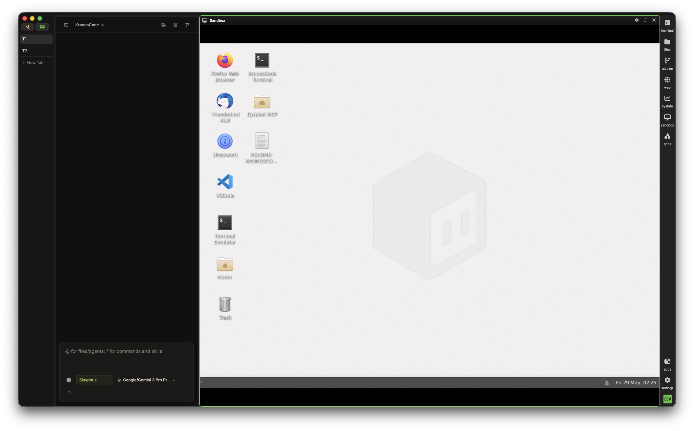

<p align="center">
  <a href="https://www.kronterm.dev">
    <picture>
      <source media="(prefers-color-scheme: dark)" srcset="./assets/pet/kronterm-pet-logo.png">
      
    </picture>
  </a>
</p>

<h1 align="center">KronTerm</h1>

<p align="center">
  <b>The AI-native desktop command center<br />for serious builders.</b>
</p>

<p align="center">
  <a href="https://www.kronterm.dev"></a>
  <a href="https://www.kronterm.dev/download"></a>
  <a href="https://docs.kronterm.dev"></a>
  <a href="https://discord.gg/XfvZ334gwU"></a>
  <a href="https://x.com/krontermdev"></a>
</p>

<br />

<p align="center">
  
</p>

<p align="center">
  <i>Terminal · Browser · Editor · Sandboxes · AI Agents · Desktop Control — one surface.</i>
</p>

<br />

---

## The Workspace That Replaces Your Entire Toolchain

**KronTerm is a commercial AI-native desktop workspace** that fuses your terminal, browser, file manager, sandbox environments, desktop automation, and AI agents into a single programmable canvas. It is the only tool in your dock — everything else lives inside it.

> **Not another terminal emulator.** Not another AI chat sidebar. KronTerm is a vertically integrated command center where every surface — shells, web views, files, Linux VMs, macOS apps — is visible to and controllable by AI agents that operate alongside you.

<br />

### The Problem: You're Juggling 5+ Tools

Every developer keeps a constellation of apps open: terminal emulator + browser (20 tabs) + IDE + AI chat + Docker/VM sandbox + notes + maybe a tile manager. Each in its own window. Each fighting for screen space. Each with its own context that the AI in the sidebar can't see.

KronTerm collapses that pile into one focused environment where **context is shared, surfaces are programmable, and AI agents operate on the real workspace — not a chat transcript.**

<br />

<details open>
<summary><b>🎬 See KronTerm in Action</b></summary>
<br />

| Demo | What You'll See |
|------|----------------|
| <video src="https://github.com/user-attachments/assets/canvas-display.mp4" width="100%" controls></video> | **Layout & Blocks** — drag, resize, arrange terminals, browsers, and sandboxes in any configuration |
| <video src="https://github.com/user-attachments/assets/browser-widget.mp4" width="100%" controls></video> | **Browser Widget** — inline Chromium web views that the AI can navigate, fill forms, and scrape |
| <video src="https://github.com/user-attachments/assets/sandbox-demo.mp4" width="100%" controls></video> | **Sandbox VM** — isolated Linux desktop (E2B-powered) with Firefox, VS Code, and terminal |
| <video src="https://github.com/user-attachments/assets/dev-server.mp4" width="100%" controls></video> | **Dev Server** — run local apps and preview changes beside your terminal and editor |

> *Note: If videos don't render on GitHub, view them on the [KronTerm website](https://www.kronterm.dev).*

</details>

<br />

---

## Core Capabilities

### 🧩 Blocks: Drag-and-Drop Workspace

Every KronTerm "block" is a fully interactive surface that can be positioned, resized, stacked, or full-screened. Blocks communicate via the `wsh` IPC protocol — and the AI can see and manipulate every single one.

| Block Type | Purpose |
|------------|---------|
| **Terminal** | Full PTY with shell integration, scrollback capture, SSH, and AI-readable command output |
| **Browser** | Embedded Chromium — docs, dashboards, previews, and AI-operated browser automation |
| **Preview** | Renders markdown, images, CSVs, PDFs, HTML — auto-refreshes on file changes |
| **AI Chat** | Inline KronosCode panel that sees the entire workspace — every block, every file, every command |
| **Sandbox** | Full Linux desktop VM (E2B) with Firefox, VS Code, terminal — isolated, disposable, programmable |
| **Launcher** | Command palette for quick actions, block creation, and workspace navigation |
| **Sys Info** | Real-time system resource monitor (CPU, memory, disk, network) |
| **Settings** | Visual editor for themes, keybindings, fonts, and AI provider configuration |

**Widget Protocol** — Every block exposes a structured accessibility tree via the widget interaction layer. The AI can snapshot, click (`@e3` refs), type, scroll, drag, inspect, screenshot, and read state from any block. This is how KronosCode operates your workspace like a human would — without separate browser automation tools, PTY libraries, or screen readers.

<br />

### 🧠 KronosCode: The AI Engine That Controls Everything

**KronosCode is not a chatbot.** It is a structured agentic execution engine that routes every request through a deterministic pipeline:

```
User Request → Router (classifies surface) → Planner (ordered steps + verification gates)
    → Executor (batch tool calls) → Critic (verify output) → Summarizer (user-facing result)
```

It operates at **every layer of the machine**:

| Layer | What KronosCode Can Do |
|-------|----------------------|
| **Screen** | Take screenshots of any block or the host macOS desktop. Read pixel colors. Track cursor positions. |
| **Accessibility** | Inspect the full AX tree of native macOS apps. Click by element ref, read values, scroll panels. |
| **Widget** | Inside KronTerm blocks: annotated screenshots with `@e3` refs, click by ref or coordinate, type, scroll to elements, drag, wait for conditions. |
| **Terminal** | Execute shell commands with timeouts, read scrollback, capture exit codes, parse JSON output. |
| **Network** | Fetch URLs, search the web, scrape pages, search code docs, make API calls. |
| **Memory** | Search screen/audio history via Screenpipe. Recall what was visible minutes ago. |

**Agent Architecture** — KronosCode uses a routing-first design with specialist agents:

```
Kronos (Router)
  ├── Hephaestus — Host terminal, code edits, builds, git
  ├── Sisyphus   — Sandbox VM, desktop widget automation
  ├── Prometheus — Native macOS app control, desktop automation
  ├── Oracle     — Browser blocks, widgets, visible tabs
  └── Librarian  — Web search, code search, documentation research
```

Every tool call is real — no simulation, no narration. If KronosCode used a tool, the runtime actually emitted the call.

> **KronosCode is included with KronTerm.** No additional setup, no premium tier for the core agent system. ACP premium agents (autonomous background agents) are coming as a commercial add-on.

<br />

### 🌐 Browser Widget: Web Views That the AI Operates

Inline Chromium browser blocks for docs, dashboards, and live app previews — right next to your terminal. Every web block is a target for KronosCode: navigate, fill forms, scrape data, take screenshots, inspect elements, all within the block.

This isn't just a browser viewer — it's a **browser automation surface** that the AI operates natively, without Playwright, Selenium, or any external tool. The `widget_snapshot` API returns the full element tree with refs like `@e3`, and the AI clicks by ref, not by fragile coordinate heuristics.

<br />

### 🖥️ Sandbox VMs: Isolated Linux Desktops on Demand

Spin up full Linux desktop VMs (E2B-powered) alongside your code. Each sandbox has Firefox, VS Code, a terminal, and its own file system — and KronosCode operates them directly.

- **Fully isolated** — root access, package installs, network ops. Nothing touches your host.
- **AI-controlled** — KronosCode can click, type, scroll, drag, open apps, read/write files inside the sandbox.
- **Disposable by design** — spin up for a test, tear down when done. No Dockerfiles, no Vagrant boxes, no cloud VM juggling.

<p align="center">
  
</p>

<br />

### 🖱️ Desktop Control: Native macOS Automation

KronosCode can observe and control any native macOS app through the accessibility API:

- **See**: Full accessibility tree of any running app — buttons, fields, menus, scroll areas
- **Click**: By element name, DOM id, or screenshot-pixel coordinates
- **Type**: Into any focused text field
- **Press**: Key combinations (⌘+C, ⌘+Shift+P, etc.)
- **Scroll**: In any direction, by lines or pages
- **Drag**: Between coordinates with configurable duration
- **Set Values**: On sliders, date pickers, and input fields

This bridges the gap between "AI that can read files" and "AI that can use your actual desktop applications."

<br />

### 🔗 Durable SSH & Remote Sessions

Your remote connections survive network drops, sleep cycles, and even KronTerm restarts. Automatic reconnection means you never lose a session mid-work. Includes a built-in graphical editor for remote files, inline previews for markdown, images, CSVs, PDFs, and more.

<br />

---

## 🏗️ Architecture: How It All Fits Together

KronTerm is a **vertically integrated system** built from four layers:

```
┌──────────────────────────────────────────────────────────────┐
│                     USER INTERFACE                           │
│  KronTerm Desktop App (Electron + TypeScript)                 │
│  • Block canvas with drag-and-drop layout engine              │
│  • WebSocket RPC bridge (wsh) between UI and Go backend       │
│  • Native menus, tabs, themes, custom keybindings             │
│  • macOS / Linux / Windows — same DX everywhere               │
├──────────────────────────────────────────────────────────────┤
│                    WIDGET LAYER (wsh IPC)                     │
│  • Every block is a widget with a structured element tree      │
│  • widget_* tools: snapshot, click, type, scroll, drag        │
│  • Terminal PTY via node-pty (local) or SSH bridge (remote)   │
│  • Chromium Embedded Framework for web blocks                 │
│  • E2B SDK for sandbox VM lifecycle management                │
├──────────────────────────────────────────────────────────────┤
│                   KRONOSCODE AI ENGINE                        │
│  • TypeScript core (Bun runtime)                              │
│  • Vercel AI SDK for multi-provider abstraction               │
│  • Hono HTTP server for local API & MCP endpoints             │
│  • Drizzle ORM + SQLite for session & tool persistence        │
│  • Zod schema validation throughout                           │
│  • LSP integration for code intelligence                      │
│  • 69+ built-in tools + MCP server integration                │
│  • Skills system (loadable domain-specific capabilities)      │
├──────────────────────────────────────────────────────────────┤
│                    AI PROVIDER LAYER                          │
│  • OpenAI (GPT-4o, o3) · Anthropic (Claude 4 Sonnet/Opus)    │
│  • Google (Gemini 2.0 Pro/Flash) · Ollama / LM Studio (local) │
│  • Bring your own keys — no accounts, no cloud dependency     │
│  • Pluggable provider architecture — add your own             │
└──────────────────────────────────────────────────────────────┘
```

### Runtime Stack

| Component | Technology | Role |
|-----------|-----------|------|
| **Desktop Shell** | Electron + TypeScript | Cross-platform window, menu, native OS integrations |
| **Backend** | Go | High-performance IPC, PTY, SSH, WebSocket bridge |
| **AI Engine** | TypeScript + Bun | Agent logic, tool execution, session management |
| **Widget Protocol** | wsh IPC (JSON over WebSocket) | Bidirectional control: AI ↔ block widgets |
| **Database** | SQLite via Drizzle ORM | Sessions, tool metadata, config storage |
| **AI SDK** | Vercel AI SDK (`ai`) | Multi-provider abstraction, streaming, tool calling |
| **HTTP** | Hono | Local API, MCP server, health checks |
| **Validation** | Zod | Runtime schema validation for all tool parameters |
| **SSH** | Go-based PTY bridge | Durable remote sessions with auto-reconnect |
| **Sandbox** | E2B SDK | Cloud Linux VM lifecycle (Firefox, VS Code, terminal) |
| **Layout Engine** | React + custom tile manager | Drag-and-drop block positioning, snap, full-screen |

<br />

---

## ⚡ ACP Agents: Autonomous Background Intelligence

Beyond KronosCode (on-demand), KronTerm supports **ACP (Agent Control Protocol)** agents — premium autonomous agents that run continuously, watching your workspace and acting on your behalf:

| Agent | Role |
|-------|------|
| **Hermes** | Personal automation — watches file changes, triggers builds, runs tests on save, keeps your dev loop spinning |
| **OpenClaw** | File system intelligence — navigates codebases, understands dependency graphs, performs large-scale refactors |
| **Codex** | Deep code generation & analysis — generates entire modules, analyzes complex code paths, produces production-grade implementations |

> **Premium feature.** ACP agents are coming as part of KronTerm's commercial tier.

<br />

---

## 🔒 Security Model

KronosCode has deep access to your system. Control is explicit:

| Mechanism | What It Prevents |
|-----------|-----------------|
| **Surface routing** | AI can't run macOS commands on the sandbox or vice versa |
| **Tool budgets** | Limits broad searches before coding — prevents runaway API costs |
| **Capability context contract** | Runtime health checks prevent calling unavailable tools |
| **Stop conditions** | AI stops when acceptance checks pass or blocked by missing credentials |
| **Git safety protocol** | Never force-pushes, amends pushed commits, or skips hooks |
| **Bring your own keys** | Your API key → AI provider → local execution. No cloud dependency. No data transit through a KronTerm service. |
| **Secret storage** | OS-native secure store (macOS Keychain, Linux secret service, Windows Credential Manager) |
| **Sandbox isolation** | E2B VMs are fully isolated — root inside the sandbox, zero impact on host |

**Data flow:**
```
Your API Key → AI Provider (OpenAI/Claude/Gemini/Ollama)
     ↓
KronosCode Engine (local — your machine)
     ↓
Tool calls executed locally
     ↓
Results return to AI → Response in your workspace
```

Your source code, terminal output, and files never transit through a KronTerm cloud service — because there is no KronTerm cloud service.

<br />

---

## 💻 Platforms

| Platform | Status |
|----------|--------|
| macOS (arm64 / x64) | ✅ Private beta |
| Windows (x64) | 🔜 Evaluation |
| Linux (arm64 / x64) | 🔜 Evaluation |

**[Request private beta access →](https://www.kronterm.dev/download)**

<br />

---

## 🔮 Roadmap

- **KronTerm API** — Programmatic workspace control. CI pipelines, automation scripts, and custom tools will drive KronTerm like a headless dev environment.
- **ACP Agents** — Hermes, OpenClaw, and Codex autonomous agents.
- **Shared Workspaces** — Multi-user layouts, remote pair debugging, team workflows.
- **Extended Desktop Control** — Windows and Linux native app automation.
- **Plugin System** — Third-party widgets, tools, and agent integrations.

See the full [ROADMAP.md](./ROADMAP.md) for details. Want to influence the direction? [Join our Discord](https://discord.gg/XfvZ334gwU).

<br />

---

## Community & Links

| | |
|---|---|
| 🌐 **Website** | [kronterm.dev](https://www.kronterm.dev) |
| 📖 **Docs** | [docs.kronterm.dev](https://docs.kronterm.dev) |
| ⬇️ **Download** | [kronterm.dev/download](https://www.kronterm.dev/download) |
| 🐦 **X** | [@krontermdev](https://x.com/krontermdev) |
| 💬 **Discord** | [Join the community](https://discord.gg/XfvZ334gwU) |
| 🐙 **GitHub** | [krontermdev/kronterm](https://github.com/krontermdev/kronterm) |

<br />

---

<p align="center">
  <b>KronTerm is a commercial AI-native workspace.</b><br />
  <i>Built for developers, founders, and teams who need one desktop command center<br />for terminal, browser, sandboxes, and AI-assisted execution.</i>
</p>

<p align="center">
  <sub>Copyright © 2026 KronTerm. All rights reserved.</sub>
</p>
